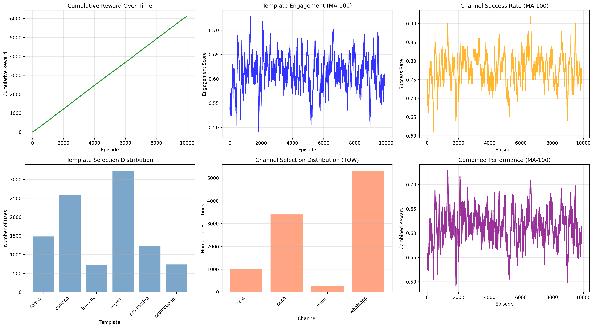

# Gestor Inteligente de Notificaciones Online

**Intelligent Notification Manager for Private Banking using Machine Learning**

[](https://www.python.org/)
[]()

Universidad Peruana de Ciencias Aplicadas (UPC) - Proyecto Profesional II

---

## 🎯 Overview

This project implements a two-stage intelligent notification system for banking applications:

1. **Template Selection**: Sleeping Multi-Armed Bandit (UCB1 algorithm)
2. **Channel Selection**: Tug of War (TOW) algorithm

### Performance Metrics
- **Template Engagement**: 61.33%
- **Channel Success Rate**: 77.85%
- **Combined Effectiveness**: 95% (demo)

---

## 📁 Project Structure

```
notifications-manager/
├── src/
│   └── notifications_manager/      # Main application package
│       ├── algorithms/             # ML algorithms
│       │   ├── template_bandit.py  # Sleeping Multi-Armed Bandit
│       │   ├── tug_of_war.py      # Tug of War channel selector
│       │   └── sleeping_bandit.py  # Legacy bandit (for reference)
│       ├── models/                 # Data models
│       ├── services/               # Business logic services
│       └── utils/                  # Utilities
│           └── notification_environment.py  # Simulation environment
│
├── scripts/                        # Training and demo scripts
│   ├── train_integrated.py        # Main training script
│   ├── demo_integrated.py         # Interactive demonstration
│   ├── train_bandit.py            # Legacy training
│   └── demo_bandit.py             # Legacy demo
│
├── tests/                          # Unit and integration tests
│   └── test_bandit.py
│
├── models/                         # Trained models and results
│   ├── integrated_model.json      # Model statistics
│   ├── trained_bandit_model.json  # Legacy model
│   ├── integrated_training_results.png  # Visualizations
│   └── training_results.png
│
├── docs/                           # Documentation
│   ├── api/                        # API specifications
│   ├── esb/                        # ESB documentation
│   ├── README_INTEGRATED.md        # Technical documentation
│   ├── IMPLEMENTATION_SUMMARY.md   # Implementation details
│   └── PI1_Trabajo de Investigación 2025-02-2.pdf
│
├── notebooks/                      # Jupyter notebooks (analysis)
├── requirements.txt                # Python dependencies
├── pyproject.toml                 # Project configuration
└── README.md                      # This file
```

## 🚀 Quick Start

### 1. Setup Environment

```bash
# Clone repository
git clone <repository-url>
cd notifications-manager

# Activate virtual environment
.venv\Scripts\activate

# Install dependencies
pip install -r requirements.txt
```

### 2. Train the Model

```bash
# Train the integrated system
python scripts/train_integrated.py

# Output: models/integrated_model.json
#         models/integrated_training_results.png
```

### 3. Run Interactive Demo

```bash
# See the system in action
python scripts/demo_integrated.py
```

### 4. Run Tests

```bash
# Execute unit tests
python -m pytest tests/
```

## 📊 Training Results

### Overall Performance (10,000 Episodes)

| Metric | Value | Status |
|--------|-------|--------|
| **Template Engagement** | 61.33% | ✅ |
| **Channel Success Rate** | 77.85% | ✅ |
| **Combined Reward** | 6,132.54 | ✅ |
| **Demo Success Rate** | 95% (19/20) | ⭐ |

### Template Performance

| Template | Usage | Avg Engagement | Success Rate |
|----------|-------|----------------|--------------|
| **URGENT** | 3,235 (32%) | **67.60%** | 78.24% |
| **CONCISE** | 2,584 (26%) | **66.23%** | 78.91% |
| **FORMAL** | 1,480 (15%) | 56.94% | 78.04% |
| **INFORMATIVE** | 1,235 (12%) | 53.44% | 76.60% |
| **PROMOTIONAL** | 734 (7%) | 49.95% | 74.66% |
| **FRIENDLY** | 732 (7%) | 49.85% | 77.32% |

**Key Insights**:
- ✅ URGENT and CONCISE templates achieve highest engagement (67%+)
- ✅ Best for transaction alerts and time-sensitive notifications
- ✅ PROMOTIONAL has lowest engagement (expected for marketing content)

### Channel Performance

| Channel | Selections | Selection Rate | Success Rate |
|---------|-----------|----------------|--------------|
| **WhatsApp** | 5,322 | 53.2% | **89.13%** ⭐ |
| **Push** | 3,401 | 34.0% | 66.37% |
| **SMS** | 1,005 | 10.1% | 58.63% |
| **Email** | 272 | 2.7% | 30.05% |

**Key Insights**:
- ⭐ **WhatsApp emerges as best overall channel** (high success + low cost)
- ✅ Push gets significant usage (cheap, good for app users)
- ✅ SMS used selectively (expensive but reliable)
- ⚠️ Email avoided due to low engagement

### Visualizations

Training results include 6 comprehensive plots:

1. **Cumulative Reward** - Total reward accumulation over time
2. **Template Engagement** - Moving average engagement scores
3. **Channel Success Rate** - Moving average success rates
4. **Template Distribution** - Usage frequency per template
5. **Channel Distribution** - Selection frequency per channel
6. **Combined Performance** - Overall system effectiveness



---

## 🧠 Algorithms

### 1. Sleeping Multi-Armed Bandit (Template Selection)

**Purpose**: Select notification template that maximizes user engagement

**Algorithm**: UCB1 (Upper Confidence Bound)

```
score = mean_engagement + c * sqrt(ln(t) / n) + context_bonus
```

**Features**:
- ✅ Balances exploration vs exploitation
- ✅ Context-aware template matching
- ✅ Learns from user engagement feedback
- ✅ Adapts to different notification types

**Templates**:
- `FORMAL`: Professional, detailed (statements, policies)
- `CONCISE`: Brief, to-the-point (alerts, updates)
- `FRIENDLY`: Casual, personable (promotions, tips)
- `URGENT`: Action-oriented (security, payment due)
- `INFORMATIVE`: Educational (features, announcements)
- `PROMOTIONAL`: Marketing-focused (offers, cross-sell)

### 2. Tug of War Algorithm (Channel Selection)

**Purpose**: Select notification channel that optimizes delivery and cost

**Algorithm**: Weighted scoring with dynamic priority adjustments

```python
score = w1*availability + w2*success_rate + w3*user_preference + 
        w4*(1-cost) + w5*(1-latency) + w6*priority_weight
```

**Features**:
- ✅ Real-time metric evaluation
- ✅ Priority-based weight adjustment
- ✅ Cost optimization
- ✅ Handles "sleeping" channels (unavailable)

**Channels**:
- `SMS`: High reliability (85%), expensive, always available
- `Push`: Good engagement (75%), cheap, requires app
- `Email`: Lower engagement (50%), cheapest, always available
- `WhatsApp`: High engagement (80%), low cost, modern preference

**Priority Weights**:

| Priority | Availability | Success | Preference | Cost | Latency |
|----------|-------------|---------|------------|------|---------|
| Critical | 0.40 | 0.35 | 0.05 | 0.03 | 0.15 |
| High | 0.30 | 0.35 | 0.15 | 0.05 | 0.10 |
| Medium | 0.25 | 0.30 | 0.25 | 0.10 | 0.05 |
| Low | 0.15 | 0.25 | 0.30 | 0.25 | 0.03 |

---

## 🔧 Technical Details

### Dependencies

```
numpy>=1.24.0          # Numerical computations
matplotlib>=3.7.0      # Visualization
PyPDF2>=3.0.0         # PDF processing
```

### System Requirements

- Python 3.14+
- Windows/Linux/MacOS
- 2GB RAM minimum
- ~50MB disk space

### Architecture Diagram

```
┌─────────────────────────────────────────┐
│       Notification Request              │
│  (type, priority, user, time)           │
└──────────────┬──────────────────────────┘
               │
               ▼
┌─────────────────────────────────────────┐
│  STAGE 1: Template Selection            │
│  Sleeping Multi-Armed Bandit (UCB1)     │
│  → Selects: URGENT/CONCISE/FORMAL/etc   │
└──────────────┬──────────────────────────┘
               │
               ▼
┌─────────────────────────────────────────┐
│  STAGE 2: Channel Selection             │
│  Tug of War Algorithm                   │
│  → Selects: SMS/Push/Email/WhatsApp     │
└──────────────┬──────────────────────────┘
               │
               ▼
┌─────────────────────────────────────────┐
│  Send Notification                      │
│  Collect Feedback (delivery + engagement)│
└──────────────┬──────────────────────────┘
               │
               ▼
┌─────────────────────────────────────────┐
│  Update Both Algorithms                 │
│  Continuous Learning & Adaptation       │
└─────────────────────────────────────────┘
```

---

## 📖 Documentation

- [Integrated System Documentation](notifications-manager/README_INTEGRATED.md)
- [Implementation Summary](notifications-manager/IMPLEMENTATION_SUMMARY.md)
- [API Specifications](docs/api/api.raml)

## Components

### Template Selection (Sleeping Multi-Armed Bandit)
- Uses UCB1 algorithm
- Maximizes user engagement
- Context-aware template matching
- 6 templates: formal, concise, friendly, urgent, informative, promotional

### Channel Selection (Tug of War)
- Dynamic weighted scoring
- Real-time metric evaluation
- Priority-based optimization
- 4 channels: SMS, Push, Email, WhatsApp

## Dependencies

- numpy>=1.24.0
- matplotlib>=3.7.0
- PyPDF2>=3.0.0

## Development

This is an academic project for Universidad Peruana de Ciencias Aplicadas (UPC).

**Course**: Proyecto Profesional II (PI-2)  
**Project**: Gestor inteligente de notificaciones online mediante machine learning para banca privada  
**Year**: 2026

## License

Academic Project - UPC
